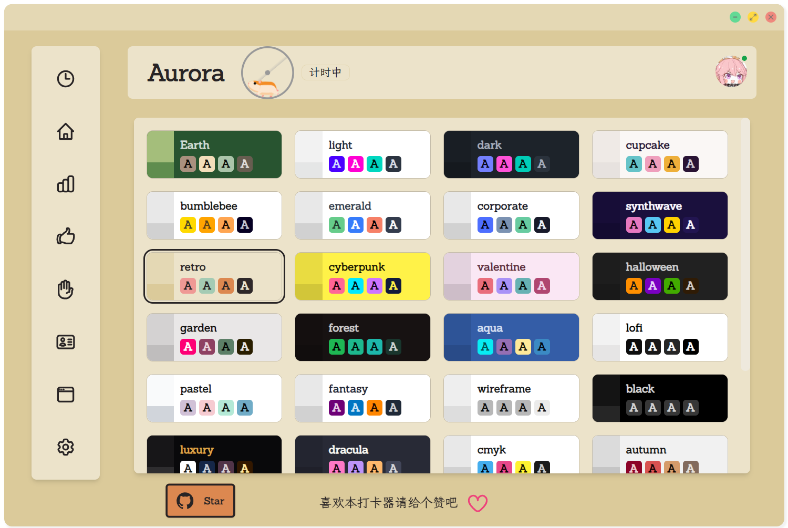

# AuroraTimer_Next


   

Next Gen AuroraTimer,now work in progress!

新版极光工作室打卡器! 现在正在开发中!

## Recommended IDE Setup

- [VSCode](https://code.visualstudio.com/) + [ESLint](https://marketplace.visualstudio.com/items?itemName=dbaeumer.vscode-eslint) + [Prettier](https://marketplace.visualstudio.com/items?itemName=esbenp.prettier-vscode)
- ~~其实WebStorm也彳~~

## Project Setup 项目配置

### Environment 环境需求

> Node.js >=16 最好是18+
>
> yarn
>
> 一个好的“网络”环境

使用Yarn进行依赖管理

### Install 初始化

```bash
$ yarn install
```

### Development 开发调试

```bash
$ yarn run dev
```

### Build 生产环境部署

```bash
##不能跨平台编译哦!!!
# For windows
$ yarn run build:win

# For macOS
$ yarn run build:mac

# For Linux
$ yarn run build:linux
```
## 结构解释
```shell
|-- VuePlugins vue chrome 插件
|-- build 编译目录
|-- dev-app-update.yml
|-- dist 打包输出目录
|-- electron-builder.yml 打包配置
|-- electron.vite.config.js electron-vite 配置文件
|-- out electron-vite 编译目录
|-- package.json npm项目配置
|-- postcss.config.js
|-- public 主进程资源文件
|-- resources 主进程资源文件
|-- src 源代码目录
|-- tailwind.config.js
```
src目录下:
```
|-- assets 素材文件夹
|-- main 主进程js
|-- preload 预加载js
|-- renderer 渲染进程(vue)
|   |-- index.html 原生HTML(root)
|   `-- src Vue代码
|       |-- App.vue
|       |-- Page 页面目录
|       |-- api api设置
|       |   |-- API.ts
|       |   `-- interfaces 接口规范ts
|       |-- assets 素材文件夹
|       |-- components 组件文件夹
|       |-- main.js 渲染进程的main.js
|       |-- stores Pinia管理
|       |   |-- Admin.ts
|       |   |-- Global.ts
|       |   `-- Timer.ts
|       |-- tailwindcss.css
|       `-- utils 工具类
```
### 页面图片

主页面:


计时表格：


主题更换：




